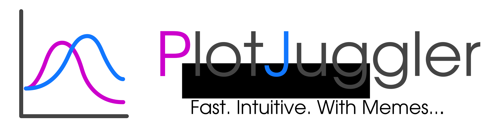
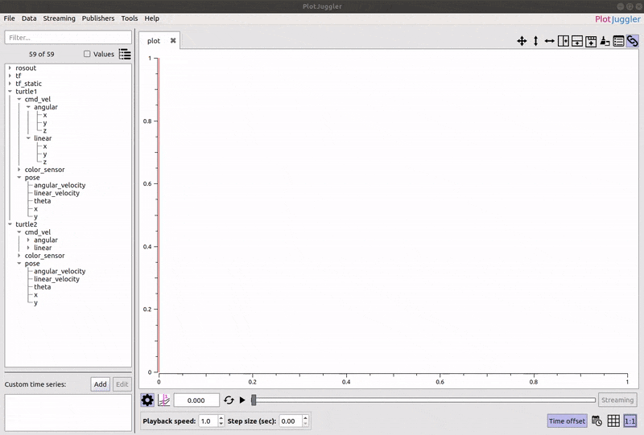
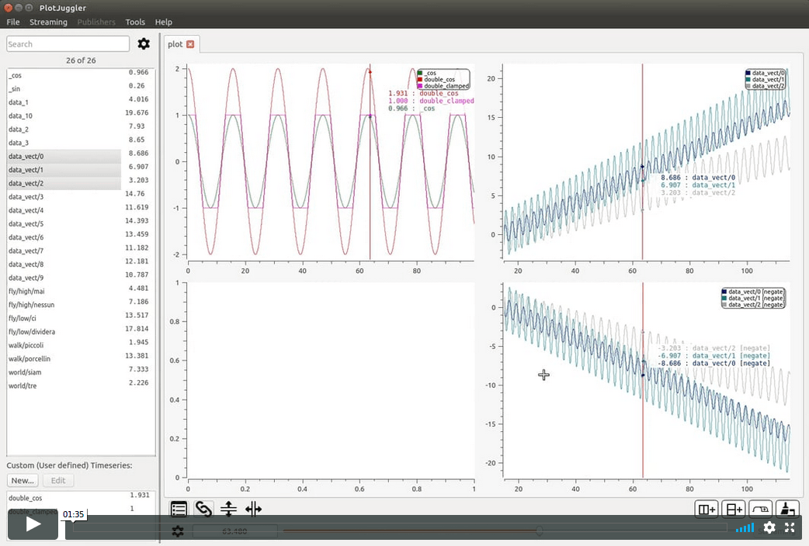

| ROS (Kinetic / Melodic)  | ROS2 (Eloquent) | Windows (Mingw)  |
|---------------------|-----------|-----------|
|  |  |  |

# PlotJuggler 2.8.4

QT5 based application to display time series in plots, using an intuitive "drag and drop" interface.

It can be used either to:

- load __static data from file__ or 
- connect to live __streaming__ of data.

Its functionality can be easily extended through __plugins__.

To understand what PlotJuggler can do for you, take a look to the following video [PlotJuggler on Vimeo](https://vimeo.com/214389001) 

## Supported formats

- CSV
- Rosbags / ROS topics (both ROS1 and ROS2)
- ULog (PX4)
- Your custom format... [contact me to know more](https://www.plotjuggler.io/support).

## Compute calculations and transform your data

It is now possible to create custom timeseries! Simply write your own
**JavaScript** or **Lua** function and apply it to one of more existing timeseries.

Many thanks to [@1r0b1n0](https://github.com/1r0b1n0), who developed the
initial version of this feature, and to our first __sponsor__, 
a robotics company that made a donation, but prefers to remain anonymous for the time being.

Watch this video to learn how to use it.

## "Download and Run" 

For those of you that can't wait and want to get their hands dirty, you can download these binaries:

**Linux with ROS plugins**: [PlotJuggler-Linux-ROS-2.8.4.AppImage](https://github.com/facontidavide/PlotJuggler/releases/download/2.8.4/PlotJuggler-Linux-ROS-2.8.4.AppImage).
   
Do not forget to make it executable with the command 

    chmod +x ./PlotJuggler-*-x86_64.AppImage
	
    
**Windows Installer**: [PlotJuggler_WIN_Installer-2.8.4.exe](https://github.com/facontidavide/PlotJuggler/releases/download/2.8.4/PlotJuggler_WIN_Installer-2.8.4.exe).

## How to build (without ROS plugins)

Clone the repository as usual:

      git clone https://github.com/facontidavide/PlotJuggler.git

The only binary dependency that you need installed in your system is Qt5. 
On Ubuntu the debians can be installed with the command:

    sudo apt-get -y install qtbase5-dev libqt5svg5-dev qtdeclarative5-dev qtmultimedia5-dev libqt5multimedia5-plugins
    
On Fedora:

    sudo dnf install qt5-qtbase-devel qt5-qtsvg-devel qt5-qtdeclarative-devel qt5-qtmultimedia-devel
    
Then compile using cmake (qmake is NOT supported):

     mkdir build; cd build
     cmake ..
     make
     sudo make install
 
 Note: the plugins need to be installed in the same folder of the executable or in __/usr/local/lib/PlotJuggler/__.

## How to build (ROS/ROS2 users)

 The easiest way to install PlotJuggler is through the command:
 
    sudo apt-get install ros-${ROS_DISTRO}-plotjuggler 

Nevertheless, if you want to compile it from source, for instance to try the very latest version on the master branch, 
you **must** build PlotJuggler using either **catkin** or **colcon**, otherwise the ROS related plugins will **not** be included.

Compiling with catkin_tools:

    mkdir -p ws_plotjuggler/src; cd ws_plotjuggler/src
    git clone https://github.com/facontidavide/PlotJuggler.git
    cd ..
    rosdep install --from-paths src --ignore-src --rosdistro=${ROS_DISTRO} -y
    catkin build
    source devel/setup.bash
    
You should see the following message at the beginning of the compilation step:

    "PlotJuggler is being built using CATKIN. ROS plugins will be compiled"

Both the executable and the plugins will be created in __ws_plotjuggler/devel/lib/plotjuggler__.

To run the application, use the command:

    rosrun plotjuggler PlotJuggler  

# If you like PlotJuggler...

PlotJuggler required a lot of work to be developed; my goal is to build the most
intuitive and powerfull tool to visualize data and timeseries.

If you find PlotJuggler useful, consider making a donation on 
[PayPal](https://www.paypal.me/facontidavide) or 

If you use PlotJuggler at work, your company can become a __sponsor__ and support 
the development of those specific features they need.

[Contact me](https://www.plotjuggler.io/support) for more details.

# Stargazers over time

