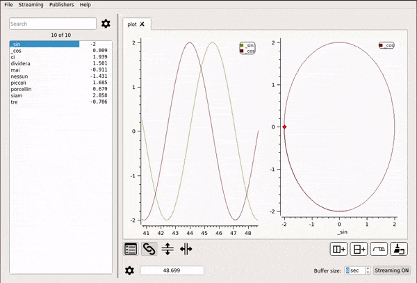

# Data Sources

PlotJuggler is most commonly used to visualize data that is stored in a log file,
for instance a [CSV](https://en.wikipedia.org/wiki/Comma-separated_values)
 or a [rosbag](http://wiki.ros.org/rosbag).
This kind of data is usually loaded using plugins named "DataLoader".	

Additionally, it is possible to visualize data that is being streamed.
The user can easily start and stope streaming and decide the size of the buffer (in seconds).

Note that some functionalities such as zoom, pan and the time tracker are disabled
when streaming is ON. 

