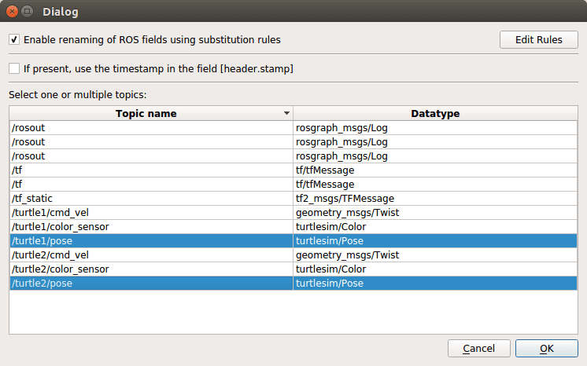
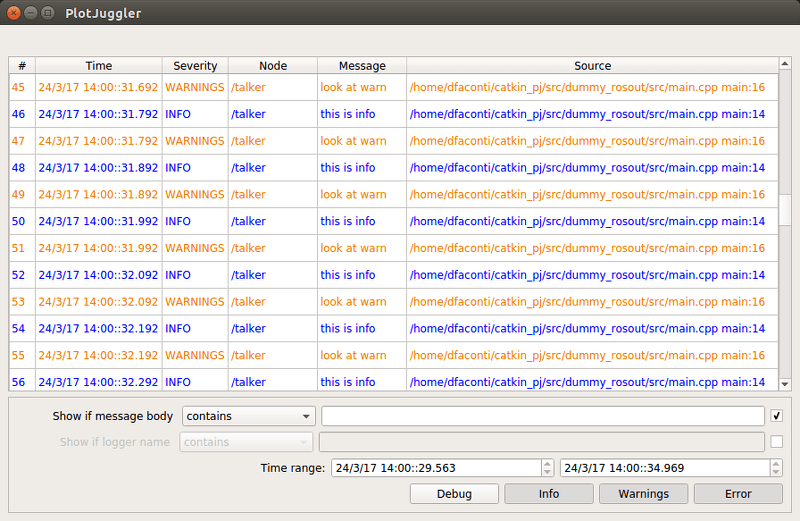

# Data sources

## DataLoadROS

This plugin is used to load rosbags.
When the user load a __.bag__ file, the following dialog is displayed:

This allows to select one or multiple topics stored inside the file.

Additionally, it is possible to activate an option called "Enable renaming of ROS field".
This option is used to rename a field in a vector using the value of a string stored in
another field of the message.

For example, we can use it to rename topic such as __sensor_msgs/JointState__
and __tf/tfMessage__.

The user can add additional rules editing the corresponding XML (Edit Rules).

For more informations, see the documentation of the package 
[ros-type-introspection](http://wiki.ros.org/ros_type_introspection#The_Renamer).

## DataStreamROS

When activated, it will show the same Dialog used by DataLoadROS to select 
the available topics.

It must be noted that a topic message can be parsed only if at least one 
message was received.

Once stopped, it provides also the ability to saved the received (and cached) 
ROS messages inside a rosbag.

#Publishers

## RosoutPublisher

This plugins simply republish the topics received by DataStreamROS.

This is usefull to connect PlotJuggler with other tools like RViz.

## RosoutPublisher

Since PlotJuggler can only visualize time series, we need a convenient way to 
match the data with the output of [rosout](http://wiki.ros.org/rosout) messages.

This plugin creates a separate window with a GUI very similar to 
[rqt_console](http://wiki.ros.org/rqt_console).

It allows to filter messages by severity, node name or text of the message.

Being a StatePublisher, it is activated by the [TimeTracker](data_source.md).
It will display only those message stored before the timestamp that corresponds
to the current position of the TimeTracker.   

