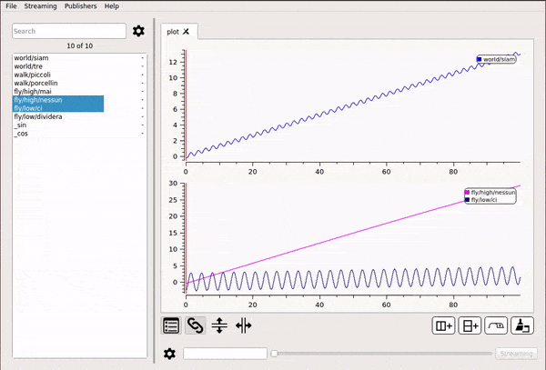
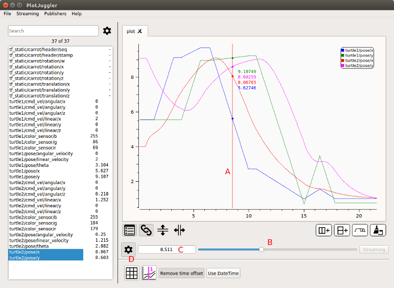

# The TimeTracker and the StatePublishers

The TimeTracker is a red vertical line which position is shared among all the PlotWidgets.

The position of the TimeTracker (A) can be changed either pressing 
__SHIFT + LEFT MOUSE__ on a certain location of a PlotWidget, or moving 
the time slider at the bottom of the screen (B).

The exact time will be diplayed in the box at the left side of the time slider (C).

To customize the way time is displayed, you can show/hide extra option pressing
the gear shaped icon (D).

Even if, apparently, the TimeTracker is just an enhancement of the UI, it 
hides a more usefull functionality.

When it is moved, all the plugins of type StatePublisher are invoked.
These plugins are mostly used to display and/or publish data points related
to the time selected by the tracker.

