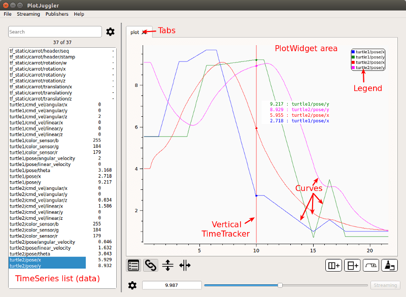
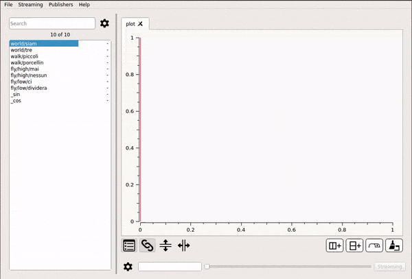
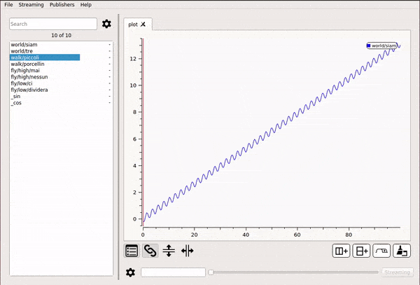
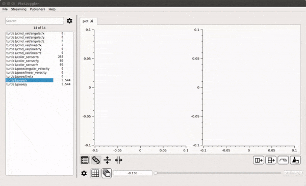
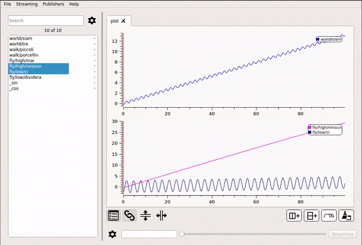
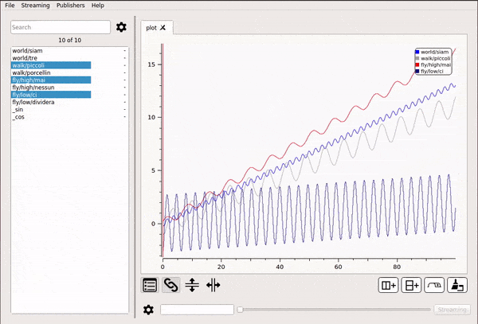
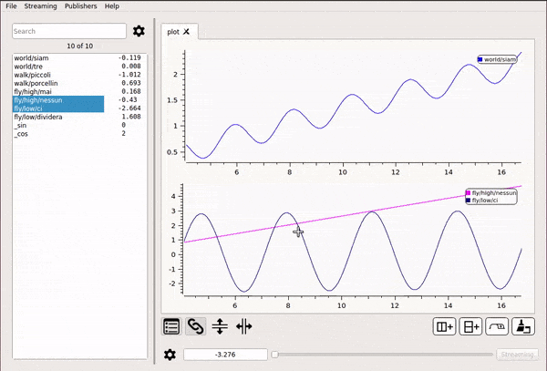

# Main concepts

Further we will use the following terms to describe some items and concepts of 
PlotJuggler.

The application consists in 1 or more __Windows__.

These is a single __MainWindow__ and 0 or more __SubWindows__.

A window can have 1 or more __Tabs.__

A tab can have 1 or more __PlotWidgets__. These widgets are arranged in 
a table of N>=1 columns and M>=1 rows. 

A plot can have 0 or more __Curves.__ Each curve corresponds to a single __Timeserie__.

The __MainWindow__ has a searchable __List of Timeseries__ on its left side.

## Add one or multiple timeseries to a PlotWidget

To display a curve inside a PlotWidget, simply select the timeserie using the __Left Mouse__ button
 then drag-and-drop it inside the plotting area.

You can select multiple curves pressing __CTRL__ or __SHIFT__. 

## Create multiple Plots

Use the __Add Column__ and __Add Row__ buttons to create a table of PlotWidgets. 
You can also add multiple Tabs and additional Windows.

## Display a XY curve

Even if PlotJuggler focuses mainly on timeseries, it is possible to mix two timeseries
that share the same time axis.
A classical example is the XY position of a robot.

To activate this mode, drag and drop the curve that shall be used as X axis using the
__RIGHT MOUSE__ button instead of the LEFT one.

## Undo / Redo

Most of the time __CTRL + Z__ does just what you expect it to do: to revert the last action.
This includes adding a plot, deleting it, add a row/column to the Tab, etc.
Press  __CTRL + SHIFT + Z__ to redo the action.

## Swap Plots

Drag and Drop an entire plot into another one to swap them. __CTRL + Right Mouse__. 

	
## Zoom area

Zoom Into a user defined rectangle pressing the __Left Mouse__ button on the plot area.

## Zoom In/Out
Zoom In and Out using the __Middle Wheel__ of the Mouse. Alternatively, you can use the buttons
__Plus(+)__ and __Minus(-)__.

## Pan
Panning is activated keeping pressed __CTRL + Left Mouse__.

