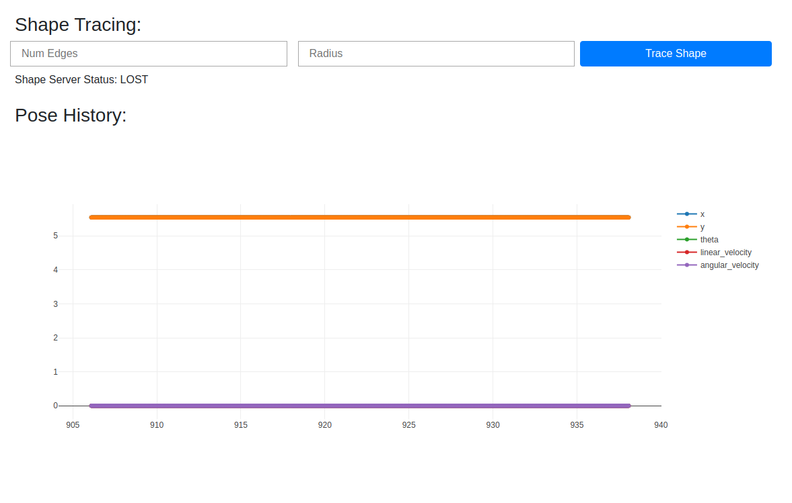
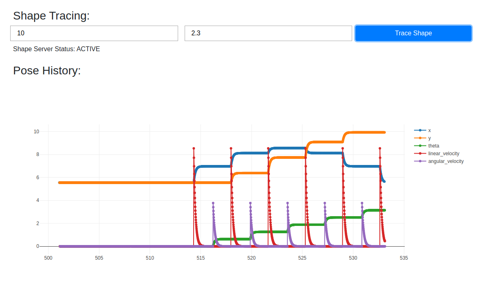

# A Dash of ROS turtlesim

[](https://travis-ci.org/banerjs/turtlesim_dash_tutorial)

This package is designed to provide a quick and dirty tutorial on how to quickly create a Web UI for a ROS environment with [Dash](https://plot.ly/dash). As backbone for this tutorial, we'll use ROS's [turtle_actionlib](http://wiki.ros.org/turtle_actionlib).


## Two Minute Intro

The default launch file included in this package, `tutorial.launch` brings up a `turtlesim` environment and starts `turtle_actionlib`'s `shape_server` node. As mentioned in the documentation for `turtle_actionlib`, the node is designed to control the simulated turtlebot so that it traces out a polygon of a specified radius with the desired number of edges.

The launch file also starts a [Dash webserver on the port 8080](http://localhost:8080). On navigating to that URL, you should see a web page like so:



There are 3 elements to the page that you can play with:

1. The input boxes set the number of edges and the radius of the polygon that the turtlebot should trace out in the simulated environment. Hitting the `Trace Shape` button sends those parameters to the `shape_server` if the values are valid.
1. The shape server's status is shown below the inputs. This is simply the status of the ROS `actionlib` server.
1. The graph plots the last 30 seconds (approximately) of the turtlebot's pose and velocity in the simulator.

Here is an example of the page as the turtlebot is executing a `ShapeGoal`:




# Menu

* [Installation](#installation)
* [ROS Nodes](#ros-nodes)
* [TODO](#todo)


## Installation

1. Install `turtle_actionlib`: `sudo apt install ros-melodic-turtle-actionlib`
1. Install the pip dependencies (in a virtualenv if need be): `pip install -r requirements.txt`
1. Create a catkin workspace and include this package in it. Build the workspace.

To test your installation, source the newly created workspace and run:

```
roslaunch turtlesim_dash_tutorial tutorial.launch
```


## ROS Nodes

### turtle_dashboard

Creates a `dash` server on the port 8080; navigate to [http://localhost:8080](http://localhost:8080) in order to view it.

* **Action Clients**
    * `/turtle_shape` ([turtle_actionlib/Shape](http://docs.ros.org/melodic/api/turtle_actionlib/html/action/Shape.html))<br>The expected action server for tracing a polygon with the desired shape and number of edges with the simulated turtlebot.
* **Subscribed Topics**
    * `/turtle1/pose` ([turtlesim/Pose](http://docs.ros.org/melodic/api/turtlesim/html/msg/Pose.html))<br>The pose of the turtle being controlled as reported by the turtlesim node.


## TODO

Some of the things that would be welcome additions in making this tutorial more complete:

- [ ] Add unit tests for each of the callbacks in `dashboard.py`
- [ ] Update the dashboard to use ROS params and services in order to better configure how the dashboard connects to turtlesim and the shape_server
- [ ] Update the web UI to control the ROS params and services
- [ ] Add the ability to control multiple simulated turtle bots
